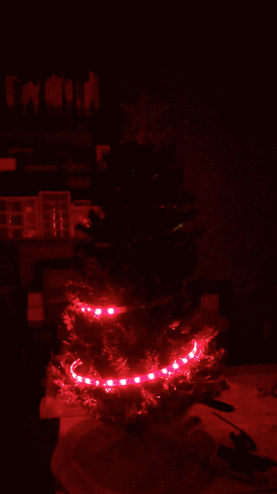
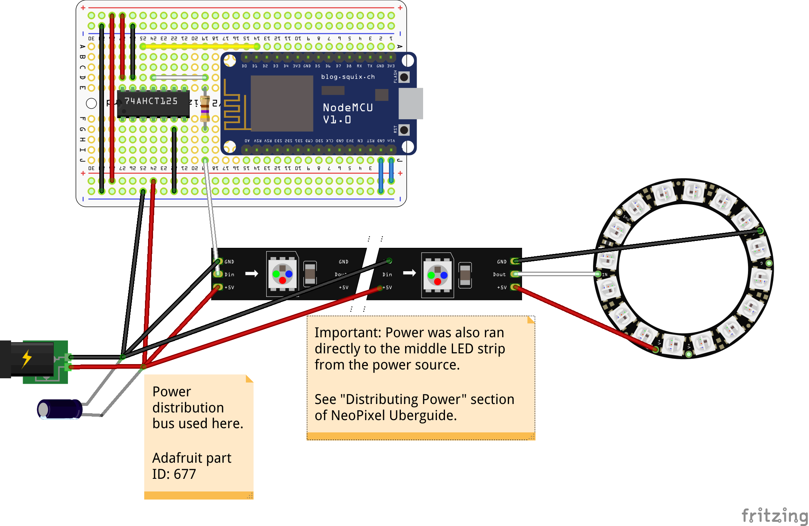

# NeoPixel Tree 🎄
A Christmas Tree powered by [Adafruit NeoPixels](https://learn.adafruit.com/adafruit-neopixel-uberguide/the-magic-of-neopixels) and an [ESP8266](https://en.wikipedia.org/wiki/ESP8266)

## Hardware
* 3 ft. miniature Christmas Tree
* [NodeMCU (ESP8266)](https://www.amazon.com/dp/B010O1G1ES/ref=cm_sw_em_r_mt_dp_U_fFc5DbDY3S39B)
* 3 strands of [Adafruit NeoPixels 1 meter strips](https://www.adafruit.com/product/1460?length=1) - 30 LEDs a strand
* 1 [NeoPixel ring](https://www.adafruit.com/product/1463) for the star
* [74AHCT125](https://www.adafruit.com/product/1787) level shifter (to shift the 3V logic to 5V for the NeoPixels)
* [4700uF 10v capacitor](https://www.adafruit.com/product/1589)
* [5V 10A power supply](https://www.adafruit.com/product/658)
* [470 ohm resistor](https://www.adafruit.com/product/2781) for NeoPixel input
* Optional terminal blocks [main power](https://www.adafruit.com/product/677)  / [for perma-proto](https://www.adafruit.com/product/724)
* Optional [permaproto board](https://www.adafruit.com/product/1609)
* Optional wrapping paper (that will have to be ripped open when servicing the box)

## Firmware
* Currently the [demo NeoPixel code](https://github.com/adafruit/Adafruit_NeoPixel/blob/master/examples/strandtest/strandtest.ino)
* Uploaded using [PlatformIO](https://platformio.org/)

## Notes
* I originally went with an Adafruit HUZZAH (ESP8266) but replaced it with the NodeMCU for the built in Schottky diode when protoyping and having the USB as well as external power connected. The NodeMCU also includes a voltage divider for inputs which don't matter as much in this application, but could if something like a microphone were to be added for changing lights to music.
* I regret using solid core wiring for this application. D'oh.

### Power distribution

With the continuous three meter strip laid out, I measured two spots to solder in power for equal distribution in both directions. I followed the advice from the [NeoPixel Überguide](https://learn.adafruit.com/adafruit-neopixel-uberguide/powering-neopixels#distributing-power-5-17).

### Connecting the ring to the end of the strip

I soldered on connectors to plug the ring to the end of the strip, which provide both power and data. This serves as a nice quick-disconnect. The ring LEDs are addressed as indices 90-105.
